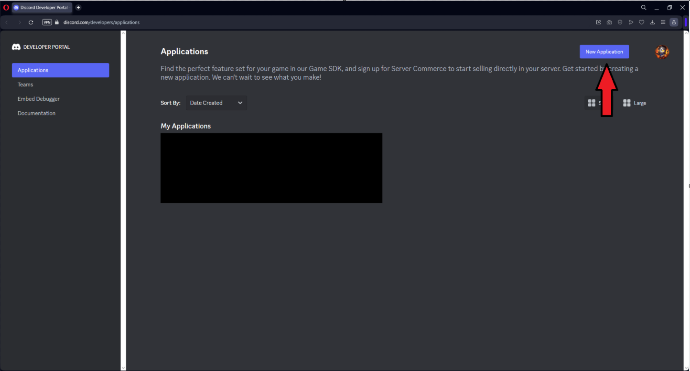
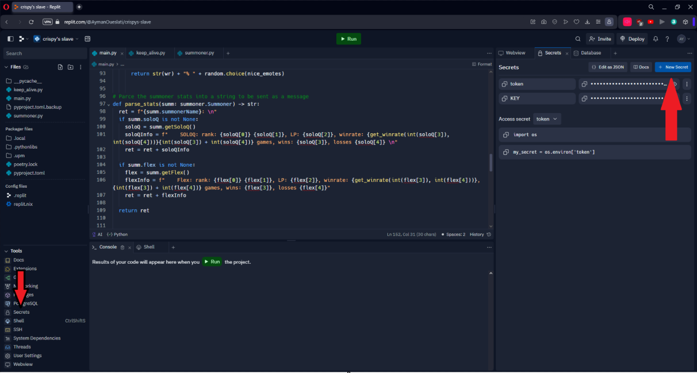
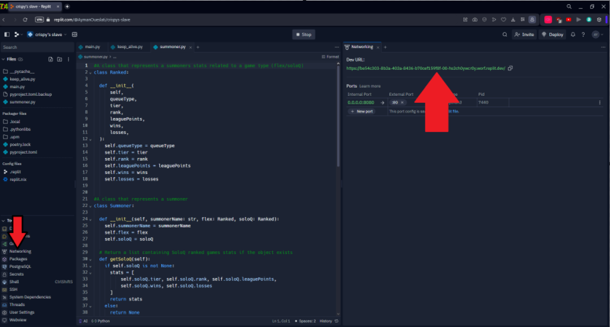
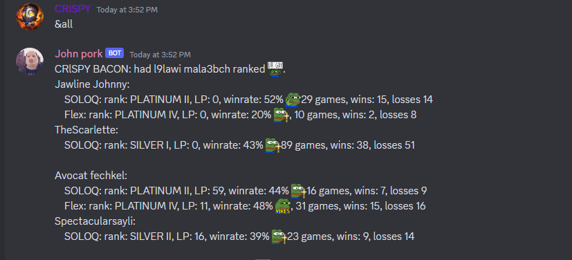

# League-bot

A discord bot made with Python. The bot can receive commands to display some League of Legends account statistics, such as rank for flex and soloq, win rate, and amount of wins and losses for the current ranked season.

# Details

The app uses the riot API to get the account information, and Replit is used to host the bot on the cloud for free. However, this bot can be hosted locally as well but the host machine has to be always on and connected to the internet for the bot to work. 
	

# Requirements

To run your own league bot you will need the following:

- Discord server
- Discord application (bot)
- Riot Games API key

# Creating the bot

In order to create the bot from the code you need to follow these steps:

1. Sign up at https://developer.riotgames.com and request an API key.
2. Create a discord server if you don't already have one.
3. Login at https://discord.com/developers/applications and create a new application

5. In the created application Go to the bot tab and get the Token and save it for later. **DO NOT SHARE THE TOKEN WITH ANYONE!!!**

. But if you want to theoretically these are the steps you should follow (I did not test this so you might have to figure some stuff out if you face any problems)
1. Clone the repo.
2. You need to have Python installed and you will need to install the discord and request packages via pip: `pip install discord requests`
3. Since you are running the program locally you won't need to hide your API key or bot token so in the code you can change the env variables to the actual value for the API key and the toke. Change the following
`API_KEY = {'api_key': str(os.getenv('KEY'))}` ->  `API_KEY = {'api_key': 'YOUR API KEY'}`
`client.run(os.getenv('token'))` -> `client.run(YOUR TOKEN)`
4. You can omit the keep_awake() line before running the client as you will be running locally. The program should be continuously run in the background for the bot to work.

### If you want to host it on a cloud solution
This is the option that I opted for. I am using Replit to host the bot, but other options are available (Render or other PaaS). In order to deploy the bot follow these steps:

1. Get an account on the preferred platform. You can get a replete account from here: https://replit.com
2. Create a new replit and choose Python as the language.
3. Then you need to create two secrets for the replit, one for the API key and one for the token, and name them 'KEY' and 'token':

5. You will need a way to keep the replit running all the time, in order to do this we will need to run a web server on a background thread because replit will stop the program otherwise. This is done with the program in the keep_wake. The keep_awake() fires up the thread that keeps the server from going to sleep. You will need to grab the URL for the server so that we can ping it:

6. Even with a web server, the program will go to sleep after 1h if there is no traffic, to solve this we can use uptimerobot. You can register here: https://uptimerobot.com. Create a new monitor, add the web server URL, and set the timer to 15 minutes. This will prevent the program from going to sleep as it is continuously being pinged.
# Showcase

You can customize the bot to your own server, for example, i have made a command for the bot that will look up my and my friends' account stats and display them, and add some emojis. There are a lot of fun features that you can add.
- Here is the welcome message when you give the hello command:
  
  
  
- Here is the output when I request an account's stats:
  
  
  
- Here is the output  custom command that I added to display everyone's stats:
  
  
  
# Further development plans

The plan for further development is:

- Extend this to give some information about Valorant games as well.
- Make it more customizable.
- Give some tips on how to improve based on game stats.

Any feature suggestion/bug report is welcome, just open a issue :).
